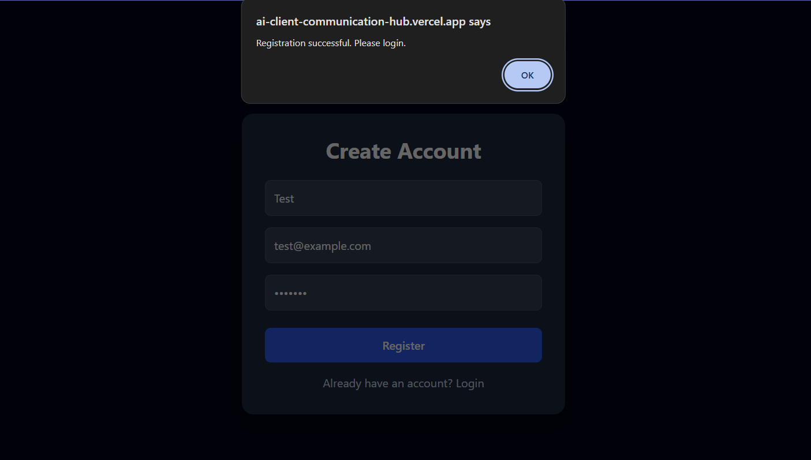
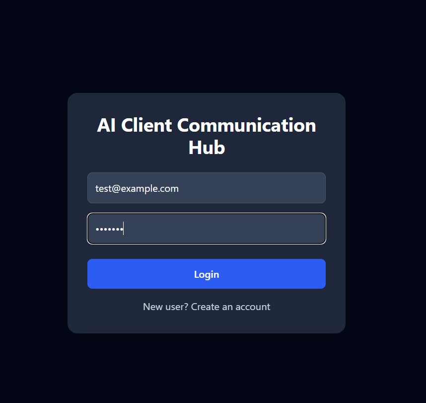
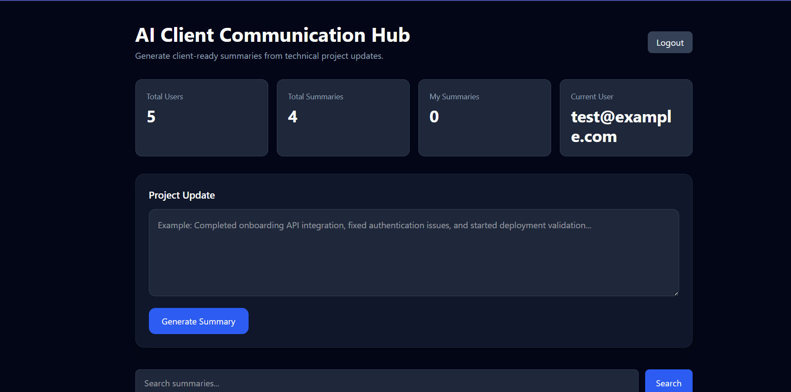
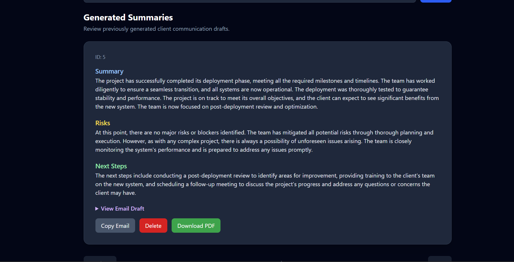
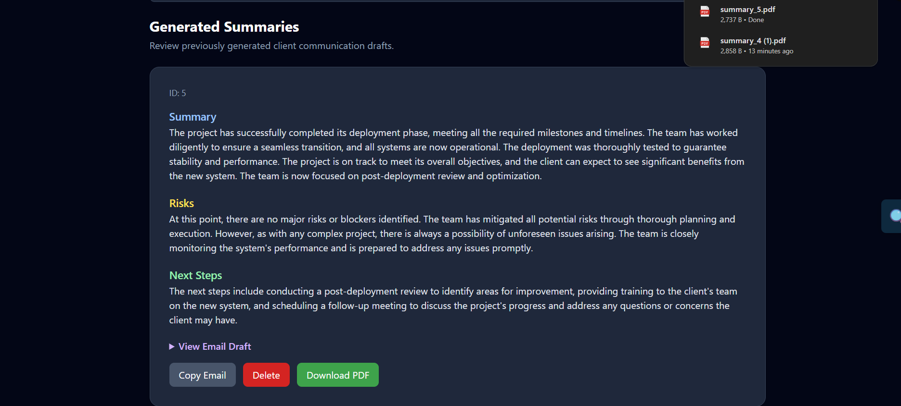

# 🚀 AI Client Communication Hub

An AI-powered full-stack web application that transforms technical project updates into client-ready business communication using Large Language Models (LLMs).

---

## 🌐 Live Demo

**Frontend:** https://ai-client-communication-hub.vercel.app

**Backend API:** [Render Backend URL]

---

## 📖 Overview

AI Client Communication Hub helps software delivery teams automate stakeholder communication by converting technical project updates into:

* Executive summaries
* Risk assessments
* Actionable next steps
* Professional client email drafts

The application leverages **Groq-hosted Llama 3.1** models to generate structured business communication while providing secure authentication, analytics, search, pagination, and PDF export capabilities.

---

## ✨ Features

### 🔐 Authentication & Security

* User Registration
* User Login
* JWT Authentication
* Protected Routes
* User-specific Data Access

### 🤖 AI-Powered Summary Generation

Generate:

* Client-Friendly Summary
* Risks & Dependencies
* Recommended Next Steps
* Professional Email Draft

from a single technical project update.

### 📊 Dashboard Analytics

View:

* Total Users
* Total Summaries
* My Summaries
* Current User

### 📄 Summary Management

* Search Summaries
* Pagination
* Filter My Summaries
* Copy Email Draft
* Download Summary as PDF
* Delete Summaries

### 🐳 DevOps & Deployment

* Dockerized Frontend & Backend
* Docker Compose
* GitHub Actions CI Pipeline
* Vercel Deployment
* Render Deployment
* PostgreSQL Database

---

## 🛠️ Tech Stack

### Frontend

* React
* Vite
* Axios
* CSS / Tailwind CSS

### Backend

* FastAPI
* SQLAlchemy
* JWT Authentication
* Pydantic

### Database

* PostgreSQL

### AI Integration

* Groq API
* Llama 3.1 8B Instant

### DevOps

* Docker
* Docker Compose
* GitHub Actions

### Deployment

* Vercel
* Render

---

## 🏗️ Architecture

```text
┌───────────────────────┐
│   React Frontend      │
│      (Vercel)         │
└──────────┬────────────┘
           │
           ▼
┌───────────────────────┐
│    FastAPI Backend    │
│       (Render)        │
└───────┬─────────┬─────┘
        │         │
        ▼         ▼
┌─────────────┐ ┌─────────────┐
│ PostgreSQL  │ │  Groq API   │
│ Database    │ │ Llama 3.1   │
└─────────────┘ └─────────────┘
```

---

## 📸 Screenshots

### Registration



### Login 



### Dashboard



### AI Generated Summary



### PDF Export



---

## 🚀 Local Setup

### Clone Repository

```bash
git clone https://github.com/richtg22/ai-client-communication-hub.git

cd ai-client-communication-hub
```

### Backend Setup

```bash
cd backend

python -m venv venv

venv\Scripts\activate

pip install -r requirements.txt

uvicorn app.main:app --reload
```

Backend available at:

```text
http://localhost:8000
```

Swagger documentation:

```text
http://localhost:8000/docs
```

### Frontend Setup

```bash
cd frontend

npm install

npm run dev
```

Frontend available at:

```text
http://localhost:5173
```

---

## 🔑 Environment Variables

### Backend (.env)

```env
DATABASE_URL=postgresql://...
SECRET_KEY=your_secret_key
GROQ_API_KEY=your_groq_api_key
```

### Frontend (.env)

```env
VITE_API_URL=https://your-backend-url.onrender.com
```

---

## 🐳 Docker Setup

Build and run the complete application:

```bash
docker compose up --build
```

Frontend:

```text
http://localhost:5173
```

Backend:

```text
http://localhost:8000/docs
```

---

## ⚙️ CI/CD Pipeline

GitHub Actions automatically:

* Installs dependencies
* Builds frontend
* Validates backend
* Runs checks on every push and pull request

Workflow:

```text
Push / Pull Request
          │
          ▼
 GitHub Actions
          │
          ▼
 Build + Validation
          │
          ▼
      Deployment
```

---

## 🎯 Key Engineering Highlights

* Built secure JWT-based authentication and authorization workflows.
* Integrated Groq-hosted Llama 3.1 models for AI-powered business communication generation.
* Implemented search, pagination, analytics, PDF export, and user-specific summary management.
* Containerized frontend and backend services using Docker and Docker Compose.
* Designed RESTful APIs using FastAPI and SQLAlchemy.
* Deployed a production-ready full-stack application using Vercel, Render, and PostgreSQL.
* Automated build validation using GitHub Actions CI workflows.

---

## 🔮 Future Enhancements

* Role-Based Access Control (RBAC)
* Email Sending Integration
* Team Collaboration Features
* Notification System
* Advanced Analytics Dashboard
* Summary Templates
* Multi-project Workspace Support

---

## 👩‍💻 Author

**Tridisha Gogoi**

GitHub: https://github.com/richtg22

LinkedIn: https://www.linkedin.com/in/tridishagogoi/

---

⭐ If you found this project interesting, feel free to star the repository.
